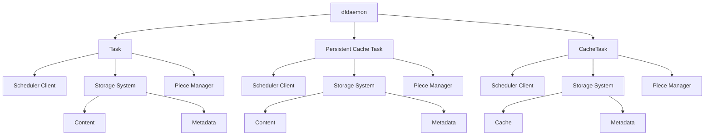

# CacheTask Support in Dragonfly

## Overview

This design document aims to extend the task processing capabilities of the Dragonfly client by introducing a new task type called CacheTask, which enables file distribution based entirely on in-memory caching. Unlike the existing Task type, CacheTask completely bypasses the disk storage layer (Content Storage) and interacts only with the in-memory cache layer (Cache Storage), thereby eliminating disk I/O bottlenecks and significantly improving the distribution performance of hot files.

## Motivation

- **Performance**: Pure in-memory operations eliminate disk I/O overhead, providing faster data access compared to existing cache systems that require disk backup.
- **Scalability**: Dynamic memory management supports more flexible caching strategies, allowing cache files to be replaced by algorithms such as LRU, and prevents system service disruption due to insufficient capacity.
- **Simplicity**: The pure in-memory architecture reduces the complexity of file system operations and avoids the overhead of disk path management.

## Goals

- Add support for CacheTask while maintaining compatibility with the existing Task and PersistentCacheTask implementations.
- Retain the current storage interfaces to ensure seamless integration with the existing task management system.
- Support Dragonfly’s pure in-memory caching mechanism without disk persistence.
- Add a dfget parameter to simplify the creation and management of CacheTask.

## Architecture



### Modules

```
client-rs/dragonfly-client-storage/src
|-metadata.rs // Add CacheTask metadata structure and related operations
|-lib.rs  // Add cache task support in Storage

client-rs/dragonfly-client/src
|-grpc
|   |-scheduler.rs    // Add scheduler communication functions related to cache task   
|   |-dfdaemon_download.rs   // Add cache task download function
|   |-dfdaemon_upload.rs   // Add cache task upload function 
|-gc/mod.rs // Add GC support for cache task
|-bin/dfget/main.rs     // Add --cache parameter to indicate downloading with cache task
|-resource
|   |-mod.rs // Add the definition for cache task
|   |-cache_task.rs // cache task manager

scheduler
|-scheduler.go  // Add support for cache resource
|-job/job.go    // Add support for cache resource in Job
|-rpcserver
|   |-rpcserver.go  // Modify serverV2 to support cache resource
|   |-scheduler_server_v2.go    // Add gRPC methods related to cache task
|-scheduling
|   |-scheduling.go // Add scheduling methods related to cache task
|   |-mocks/scheduling_mock.go  // Generate corresponding mock implementations for new scheduling methods
|   |-evaluator
|   |   |-evaluator_base.go // Add evaluation methods for cache task
|   |   |-evaluator.go  // Add evaluation methods for cache task
|-service/service_v2.go // Implement service methods for cache task
|-resource/standardcache
|   |-host_manager_test.go 
|   |-host_manager.go   // cache host manager
|   |-host.go   // cache host definition 
|   |-peer_manager_test.go
|   |-peer_manager.go   // cache peer manager
|   |-peer_test.go
|   |-peer.go   // cache peer definition
|   |-piece_test.go
|   |-piece.go  // piece definition
|   |-resource_test.go
|   |-resource.go   // Cache Resource interface and implementation 
|   |-seed_peer_client_test.go
|   |-seed_peer_client.go   // seed peer client interface and implementation
|   |-seed_peer_test.go
|   |-seed_peer.go // seed peer interface and implementation
|   |-task_manager_test.go
|   |-task_manager.go   // cache task manager
|   |-task_test.go
|   |-task.go   // cache task definition

pkg
|-types/types.go    // Add type definitions related to cache task
|-idgen/task_id.go  // Add cache task ID generation logic

```

## Implementation

### Client

#### Dfget User Interface 

Users can add the --cache parameter in dfget to indicate that the download should be performed based on CacheTask.

```rust
struct Arg{
    #[arg(  
        long = "cache",  
        default_value_t = false,  
        help = "Use cache task for download"  
    )]  
    cache: bool,
}
async fn download(
    args: Args,
    progress_bar: ProgressBar,
    download_client: DfdaemonDownloadClient,
) -> Result<()>{
    //PreProcess

    if args.cache {   
        let response = download_client.download_cache_task(DownloadCacheTaskRequest).await.inspect_err(|err| { error!("download cache task failed: {}",err)});
    } else {   
        let response = download_client.download_task(DownloadTaskRequest).await.inspect_err(|err| { error!("download task failed: {}",err)}); 
    };

    //PostProcess
}
```


#### CacheTask

The CacheTask module is a lightweight cache task manager designed based on the architecture of the Task module. This module inherits the core scheduling logic and piece management mechanism of the Task module, but simplifies the architecture for pure in-memory caching scenarios, mainly by removing persistent storage operations to achieve high-performance temporary cache management.

```rust
pub struct CacheTask {
    config: Arc<Config>,
    pub id_generator: Arc<IDGenerator>,
    storage: Arc<Storage>,
    pub scheduler_client: Arc<SchedulerClient>,
    pub backend_factory: Arc<BackendFactory>,
    pub piece: Arc<piece::Piece>,
}
impl CacheTask{
    pub fn new(
            config: Arc<Config>,
            id_generator: Arc<IDGenerator>,
            storage: Arc<Storage>,
            scheduler_client: Arc<SchedulerClient>,
            backend_factory: Arc<BackendFactory>,
        ) -> ClientResult<Self> //Create a new CacheTask.

    pub fn get(&self, id: &str) -> ClientResult<Option<metadata::CacheTask>> // Read the metadata of the cache task.

    pub fn download_finished(&self, id: &str) -> ClientResult<metadata::CacheTask> // Update thr metadata of the cache task after the download is completed.

    pub async fn prefetch_cache_task_started(&self, id: &str) -> ClientResult<metadata::CacheTask> // When the cache task prefetch starts, update the metadata of the cache task.

    // Create a cache task.
    pub async fn download_started(
            &self,
            id: &str,
            request: Download,
        ) -> ClientResult<metadata::CacheTask>{
            // 1. Prepare the metadata for the cache task.
            // 2. Send an HTTP HEAD request to get the complete metadata.
            // 3. Handle and validate the response.
            // 4. Calculate piece length.
            // 5. Create the final cache task.
        }

    // Execute the cache task to complete the download.
    pub async fn download(
            &self,
            task: &metadata::CacheTask,
            host_id: &str,
            peer_id: &str,
            request: Download,
            download_progress_tx: Sender<Result<DownloadCacheTaskResponse, Status>>,
        ) -> ClientResult<()>{
            // 1. Initialize the task and construct the list of pieces to download.
            // 2. Send download requests.
            // 3. If the piece already exists in local storage, download it locally.
            // 4. Select candidate parents from the scheduler for downloading
            // 5. Download directly from the source server.
        }

    // Download a partial task through the scheduler.
    async fn download_partial_with_scheduler(
            &self,
            task: &metadata::CacheTask,
            host_id: &str,
            peer_id: &str,
            interested_pieces: Vec<metadata::Piece>,
            content_length: u64,
            request: Download,
            download_progress_tx: Sender<Result<DownloadCacheTaskResponse, Status>>,
        ) -> ClientResult<Vec<metadata::Piece>> {
            // 1. Send a RegisterCachePeerRequest to the scheduler to register the current peer.
            // 2. Establish a connection with the scheduler.
            // 3. Receive a list of candidate parents that have the file in their cache.
            // 4. When the candidate parent list is not empty, call download_partial_with_scheduler_from_parent to download pieces from the corresponding parents.
            // 4. Check if all pieces have been downloaded. If not, request a reschedule.
            // 5. If the number of scheduling retries exceeds the configured maximum, send a failure request and exit.
            // 6. When it is necessary to download from the source, call download_partial_with_scheduler_from_source to download from the source server.
        }

    // Download a partial task from other peers through the scheduler. Read the file from the memory cache of other peers and download it.
    async fn download_partial_with_scheduler_from_parent(
            &self,
            task: &metadata::CacheTask,
            host_id: &str,
            peer_id: &str,
            parents: Vec<CachePeer>,
            interested_pieces: Vec<metadata::Piece>,
            is_prefetch: bool,
            need_piece_content: bool,
            download_progress_tx: Sender<Result<DownloadCacheTaskResponse, Status>>,
            in_stream_tx: Sender<AnnounceCachePeerRequest>,
        ) -> ClientResult<Vec<metadata::Piece>> {
            // 1. Initialize the piece collector.
            // 2. Download pieces concurrently by calling download_from_parent to download from the specified parent.
        }
}

```

#### Storage

Support for cache tasks needs to be added to the Storage module, and remove cache operations when processing tasks.

```rust
impl Storage{
    pub fn get_cache_task(&self, id: &str) -> Result<Option<metadata::CacheTask>> // Return the metadata of the cache task.
    
    pub async fn prepare_download_cache_task_started(&self, id: &str) -> Result<metadata::CacheTask> // When the cache task is downloading, prepare the metadata of the cache task.
    
    pub fn download_cache_task_finished(&self, id: &str) -> Result<metadata::CacheTask> // When the cache task download is finished, update the metadata of the cache task.
    
    pub async fn prefetch_cache_task_started(&self, id: &str) -> Result<metadata::CacheTask> // When the cache task prefetch starts, update the metadata of the cache task.
    
    pub fn upload_cache_task_finished(&self, id: &str) -> Result<metadata::CacheTask> // When the cache task upload is finished, update the metadata of the cache task.
    
    pub async fn delete_cache_task(&self, id: &str) // Delete the cache task metadata and corresponding resources.

    pub fn is_cache_task_exists(&self, id: &str) -> Result<bool> // Check if the cache task exists.

    // When the download starts, update the cache task metadata and the cache at the same time.
    pub async fn download_cache_task_started(
        &self,
        id: &str,
        piece_length: u64,
        content_length: u64,
        response_header: Option<HeaderMap>,
    ) -> Result<metadata::CacheTask> {
        // 1. Update cache task metadata.
        // 2. Reserve the memory required by the task in the cache.
    }

    // Delete the cache task metadata and corresponding resources.
    pub async fn delete_cache_task(&self, id: &str){
        // 1. Delete cache task metadata.
        // 2. Delete the task content in the cache.
    }

    // Update the piece metadata and return the piece data.
    pub async fn upload_cache_piece(
        &self,
        piece_id: &str,
        task_id: &str,
        range: Option<Range>,
    ) -> Result<impl AsyncRead>{
        // 1. If the piece is not downloaded completely, wait for it to be downloaded.
        // 2. If the piece exists in the cache, return the piece data.
        // 3. If it does not exist, return an error message.
    }

    // Save the piece data downloaded from the source address.
    pub async fn download_cache_piece_from_source_finished<R: AsyncRead + Unpin + ?Sized>(
        &self,
        piece_id: &str,
        task_id: &str,
        offset: u64,
        length: u64,
        reader: &mut R,
        timeout: Duration,
    ) -> Result<metadata::Piece>{
        // 1. Write data to the cache.
        // 2. Calculate and verify the piece digest.
        // 3. Update metadata.
    }

    // Save the piece data downloaded from other peers.
    pub async fn download_cache_piece_from_parent_finished<R: AsyncRead + Unpin + ?Sized>(
        &self,
        piece_id: &str,
        task_id: &str,
        offset: u64,
        length: u64,
        expected_digest: &str,
        parent_id: &str,
        reader: &mut R,
        timeout: Duration,
    ) -> Result<metadata::Piece>{
        // 1. Write data to the cache.
        // 2. Calculate and verify the piece digest.
        // 3. Update metadata.
    }
}

```


#### Cache

The current Cache module interface uses a piece ID-based addressing mode, while the content module uses a byte offset and length-based addressing mode, creating a semantic inconsistency. To achieve uniformity and interoperability of the storage layer interface and to add a corresponding Cache module for CacheTask, it is necessary to modify Cache, which uses an offset-length addressing mode.

```rust
pub struct Cache {
    config: Arc<Config>,
    size: u64,
    capacity: u64,
    tasks: Arc<RwLock<LruCache<String, Bytes>>>,
}
impl Cache {
    pub fn new(config: Arc<Config>) -> Self
    
    // Read the content in a task based on offset, length and range.
    pub async fn read_piece(&self, task_id: &str, offset: u64, length: u64, range: Option<Range>)-> Result<impl AsyncRead>{
        let mut tasks = self.tasks.write().await;
        let Some(task_content) = tasks.get(task_id) else {
            return Err(Error::TaskNotFound(task_id.to_string()));
        };
        drop(tasks);

        // Calculate the range of bytes to return based on the range provided.
        let (target_offset, target_length) = calculate_piece_range(offset, length, range);

        // Check if the target range is valid.
        let begin = target_offset;
        let end = target_offset + target_length;
        if end >= task_content.len() || begin > task_content.len() {
            return Err(Error::InvalidParameter);
        }

        let content = task_content.slice(begin..end);
        let reader =
            BufReader::with_capacity(self.config.storage.read_buffer_size, Cursor::new(content));
        Ok(reader)
    }

    // Write content to Cache based on the offset.
    pub async fn write_piece(&self, task_id: &str, offset: u64,  content: Bytes) -> Result<()> {
        let mut tasks = self.tasks.write().await;  
        let Some(task_content) = tasks.get(task_id) else {  
            return Err(Error::TaskNotFound(task_id.to_string()));  
        };  
        
        // Check if the write range is valid.
        let start = offset;  
        let end = start + content.len();  
        if end > task_content.len() {  
            return Err(Error::InvalidParameter);  
        }  
        
        // Write data directly to the specified offset.
        let mut task_vec = task_content.to_vec();  
        task_vec[start..end].copy_from_slice(&content);  
        *task_content = Bytes::from(task_vec);  
        
        Ok(())  
    }

    // Pre-allocate memory for a task in Cache.
    pub async fn put_cache_task(&mut self, task_id: &str, content_length: u64) {
        if content_length == 0 {
            return;
        }

        if content_length > self.capacity {
            info!("task {} is too large and cannot be cached: {}",task_id, content_length);
            return;
        }

        let mut tasks = self.tasks.write().await;
        while self.size + content_length > self.capacity {
            match tasks.pop_lru() {
                Some((_, task_content)) => {
                    self.size -= task_content.len();
                }
                None => break;
            }
        }

        let empty_content = Bytes::from(vec![0u8; content_length as usize]);  
        tasks.put(task_id.to_string(), empty_content);  
        self.size += content_length;
    }

    // Delete a task from Cache.
    pub async fn delete_cache_task(&mut self, task_id: &str) -> Result<()> {  
        let mut tasks = self.tasks.write().await;  
        let Some((_, task_content)) = tasks.pop(task_id) else {  
            return Err(Error::TaskNotFound(task_id.to_string()));  
        };  
  
        self.size -= task_content.len() as u64;  
        Ok(())  
    }  
    
    // Check if a task exists in Cache.
    pub async fn contains_cache_task(&self, id: &str) -> bool {  
        let tasks = self.tasks.read().await;  
        tasks.contains(id)  
    }  
    
    // Calculate the start and end positions to be written based on offset, length, and range.
    pub fn calculate_piece_range(offset: u64, length: u64, range: Option<Range>) -> (u64, u64) {  
        if let Some(range) = range {  
            let target_offset = max(offset, range.start);  
            let target_length = min(offset + length - 1, range.start + range.length - 1) - target_offset + 1;  
            (target_offset, target_length)  
        } else {  
            (offset, length)  
        }  
    } 
}
```

#### Dfdaemon

Dfdaemon needs to design new download and upload interfaces for cache tasks.

```rust
// Complete the cache task download.
async fn download_cache_task(
        &self,
        request: Request<DownloadCacheTaskRequest>,
    ) -> Result<Response<Self::DownloadCacheTaskStream>, Status>{
      // 1. Request processing and ID generation.
      // 2. Task startup and validation.
      // 3. Content length verification and range processing.
      // 4. Asynchronous download execution.
      // 5. Performance metrics collection.
      // 6. Prefetch.
    }

// Respond to requests from other peers for a specified piece.
async fn download_cache_piece(
        &self,
        request: Request<DownloadCachePieceRequest>,
    ) -> Result<Response<DownloadCachePieceResponse>, Status> {
      // 1. Basic information retrieval and validation.
      // 2. Get piece metadata.
      // 3. Upload piece content.
      // 4. Return response.
    }
```

#### Manager

The initialization of the cache task manager and the final drop operation need to be added.

```rust
async fn main() -> Result<(), anyhow::Error> {
    // Preprocess.

    // Initialize task manager.
    let task = Task::new(
        config.clone(),
        id_generator.clone(),
        storage.clone(),
        scheduler_client.clone(),
        backend_factory.clone(),
    )?;
    let task = Arc::new(task);

    // Initialize persistent cache task manager.
    let persistent_cache_task = PersistentCacheTask::new(
        config.clone(),
        id_generator.clone(),
        storage.clone(),
        scheduler_client.clone(),
        backend_factory.clone(),
    )?;
    let persistent_cache_task = Arc::new(persistent_cache_task);

    // Initialize cache task manager.
    let cache_task = CacheTask::new(
        config.clone(),
        id_generator.clone(),
        storage.clone(),
        scheduler_client.clone(),
        backend_factory.clone(),
    )?;
    let cache_task = Arc::new(cache_task);

    // Postprocess.

    shutdown.trigger();

    drop(task);
    drop(persistent_cache_task);
    drop(cache_task);
    drop(scheduler_client);
    drop(shutdown_complete_tx);
    let _ = shutdown_complete_rx.recv().await;

    Ok(())
}
```

#### Metadata

Need to add support for cache tasks in the metadata module.

```rust
pub fn download_cache_task_started(
        &self,
        id: &str,
        piece_length: Option<u64>,
        content_length: Option<u64>,
        response_header: Option<HeaderMap>,
    ) -> Result<CacheTask> 

pub fn download_cache_task_finished(&self, id: &str) -> Result<CacheTask>

pub fn download_cache_task_failed(&self, id: &str) -> Result<CacheTask>

pub fn prefetch_cache_task_started(&self, id: &str) -> Result<CacheTask>

pub fn prefetch_cache_task_failed(&self, id: &str) -> Result<CacheTask>

pub fn upload_cache_task_started(&self, id: &str) -> Result<CacheTask>

pub fn upload_cache_task_finished(&self, id: &str) -> Result<CacheTask>

pub fn upload_cache_task_failed(&self, id: &str) -> Result<CacheTask>

pub fn get_cache_task(&self, id: &str) -> Result<Option<CacheTask>>

pub fn is_cache_task_exists(&self, id: &str) -> Result<bool>

pub fn get_cache_tasks(&self) -> Result<Vec<CacheTask>>

pub fn delete_cache_task(&self, id: &str) -> Result<()>
```

#### Scheduler

Need to add support for cache tasks at the scheduler level.

```rust
pub async fn announce_cache_peer(
        &self,
        task_id: &str,
        peer_id: &str,
        request: impl tonic::IntoStreamingRequest<Message = AnnounceCachePeerRequest>,
    ) -> Result<tonic::Response<tonic::codec::Streaming<AnnounceCachePeerResponse>>> 

pub async fn stat_cache_peer(&self, request: StatCachePeerRequest) -> Result<CachePeer> 

pub async fn delete_cache_peer(&self, request: DeleteCachePeerRequest) -> Result<()>

pub async fn stat_cache_task(&self, request: StatCacheTaskRequest) -> Result<CacheTask> 

pub async fn delete_cache_task(&self, request: DeleteCacheTaskRequest) -> Result<()> 
```

#### Garbage Collection

Need to add support for cache task garbage collection functionality.

```rust
async fn evict_cache_task_by_ttl(&self) -> Result<()> 

async fn delete_cache_task_from_scheduler(&self, task: metadata::CacheTask) 
```


### Server

#### API Definition

To support the new cache task, it is necessary to add API definitions for gRPC communication.

```proto
// DownloadCacheTaskStartedResponse is the response in DownloadCacheTaskResponse that indicates the cache task download has started.
message DownloadCacheTaskStartedResponse {
  uint64 content_length = 1;
  optional common.v2.Range range = 2;
  map<string, string> response_header = 3;
  repeated common.v2.Piece pieces = 4;
}

// DownloadCacheTaskResponse represents the response for a cache task download.
message DownloadCacheTaskResponse {
  string host_id = 1;
  string task_id = 2;
  string peer_id = 3;

  oneof response {
    DownloadCacheTaskStartedResponse download_cache_task_started_response = 4;
    DownloadPieceFinishedResponse download_piece_finished_response = 5;
  }
}

// RegisterCachePeerRequest represents a peer registration request.
message RegisterCachePeerRequest {
  common.v2.Download download = 1;
}

// DownloadCachePeerStartedRequest represents a request for when a peer starts downloading.
message DownloadCachePeerStartedRequest {
}

// DownloadCachePeerBackToSourceStartedRequest represents a request for when a peer starts downloading from the source.
message DownloadCachePeerBackToSourceStartedRequest {
  optional string description = 1;
}


// RescheduleCachePeerRequest represents a reschedule request.
message RescheduleCachePeerRequest {
  repeated common.v2.CachePeer candidate_parents = 1;
  optional string description = 2;
}

// DownloadCachePeerFinishedRequest represents a request for when a peer has finished downloading.
message DownloadCachePeerFinishedRequest {
  uint64 content_length = 1;
  uint32 piece_count = 2;
}

// DownloadCachePeerBackToSourceFinishedRequest represents a request for when a peer has finished downloading from the source.
message DownloadCachePeerBackToSourceFinishedRequest {
  uint64 content_length = 1;
  uint32 piece_count = 2;
}

// DownloadCachePeerFailedRequest represents a request for when a peer fails to download.
message DownloadCachePeerFailedRequest {
  optional string description = 1;
}

// DownloadCachePeerBackToSourceFailedRequest represents a request for when a peer fails to download from the source.
message DownloadCachePeerBackToSourceFailedRequest {
  optional string description = 1;
}

// AnnounceCachePeerRequest represents a peer announcement request.
message AnnounceCachePeerRequest {
  string host_id = 1;
  string task_id = 2;
  string peer_id = 3;

  oneof request {
    RegisterCachePeerRequest register_cache_peer_request = 4;
    DownloadCachePeerStartedRequest download_cache_peer_started_request = 5;
    DownloadCachePeerBackToSourceStartedRequest download_cache_peer_back_to_source_started_request = 6;
    RescheduleCachePeerRequest reschedule_cache_peer_request = 7;
    DownloadCachePeerFinishedRequest download_cache_peer_finished_request = 8;
    DownloadCachePeerBackToSourceFinishedRequest download_cache_peer_back_to_source_finished_request = 9;
    DownloadCachePeerFailedRequest download_cache_peer_failed_request = 10;
    DownloadCachePeerBackToSourceFailedRequest download_cache_peer_back_to_source_failed_request = 11;
    DownloadPieceFinishedRequest download_piece_finished_request = 12;
    DownloadPieceBackToSourceFinishedRequest download_piece_back_to_source_finished_request = 13;
    DownloadPieceFailedRequest download_piece_failed_request = 14;
    DownloadPieceBackToSourceFailedRequest download_piece_back_to_source_failed_request = 15;
  }
}

// DeleteCacheTaskRequest represents a request to delete a cache task.
message DeleteCacheTaskRequest {
  string host_id = 1;
  string task_id = 2;
}


// StatCacheTaskRequest represents a request to get the status of a cache task.
message StatCacheTaskRequest {
  string host_id = 1;
  string task_id = 2;
}

// EmptyCacheTaskResponse represents an empty cache task response.
message EmptyCacheTaskResponse {
}

// NormalCacheTaskResponse represents a normal cache task response.
message NormalCacheTaskResponse {
  // Candidate parents.
  repeated common.v2.CachePeer candidate_parents = 1;
}
```

#### Rpc Server

```go
func newSchedulerServerV2(
	cfg *config.Config,
	resource standard.Resource,
	persistentCacheResource persistentcache.Resource,
    CacheResource standardcache.Resource,
	scheduling scheduling.Scheduling,
	dynconfig config.DynconfigInterface,
) schedulerv2.SchedulerServer

func (s *schedulerServerV2) AnnounceCachePeer(stream schedulerv2.Scheduler_AnnounceCachePeerServer) error

func (s *schedulerServerV2) StatCachePeer(ctx context.Context, req *schedulerv2.StatCachePeerRequest) (*commonv2.Peer, error)

func (s *schedulerServerV2) DeleteCachePeer(ctx context.Context, req *schedulerv2.DeleteCachePeerRequest) (*emptypb.Empty, error)

func (s *schedulerServerV2) StatCacheTask(ctx context.Context, req *schedulerv2.StatCacheTaskRequest) (*commonv2.Task, error)

func (s *schedulerServerV2) DeleteCacheTask(ctx context.Context, req *schedulerv2.DeleteCacheTaskRequest) (*emptypb.Empty, error)
```

#### Scheduling

```go
type Scheduling interface {
	ScheduleCacheCandidateParents(context.Context, *standardcache.Peer, set.SafeSet[string]) error  // Schedule candidate parents to a normal peer for downloading a task.

	FindCacheCandidateParents(context.Context, *standardcache.Peer, set.SafeSet[string]) ([]*standardcache.Peer, bool)  // Find candidate parents for a peer to download a task.

	FindCacheSuccessParent(context.Context, *standardcache.Peer, set.SafeSet[string]) (*standardcache.Peer, bool)   // Find a successful parent for a peer to download a task.
}

```


## Testing

1. **Unit Tests**: Test individual components with a coverage of over 85%.
2. **Integration Tests**: End-to-end functional verification.
3. **Performance Tests**: Performance comparison between CacheTask and Task.
4. **Stress Tests**: High-concurrency testing.


## Compatibility

1. **Backward compatibility**: The existing Task and PersistentCacheTask functionalities remain unchanged, and CacheTask operates independently as a new task type.
2. **Parameter**: New cache task-related configurations are added, allowing users to enable or disable the CacheTask feature through parameters.

## Future

1. **Dynamic capacity management**: Dynamically adjust cache capacity and LRU strategy based on system load and memory usage.
2. **Cache preheating**: Support predictive cache loading to proactively load hot files into memory.

---

This design provides a foundation for adding pure in-memory CacheTask support to Dragonfly while maintaining system stability and backward compatibility.