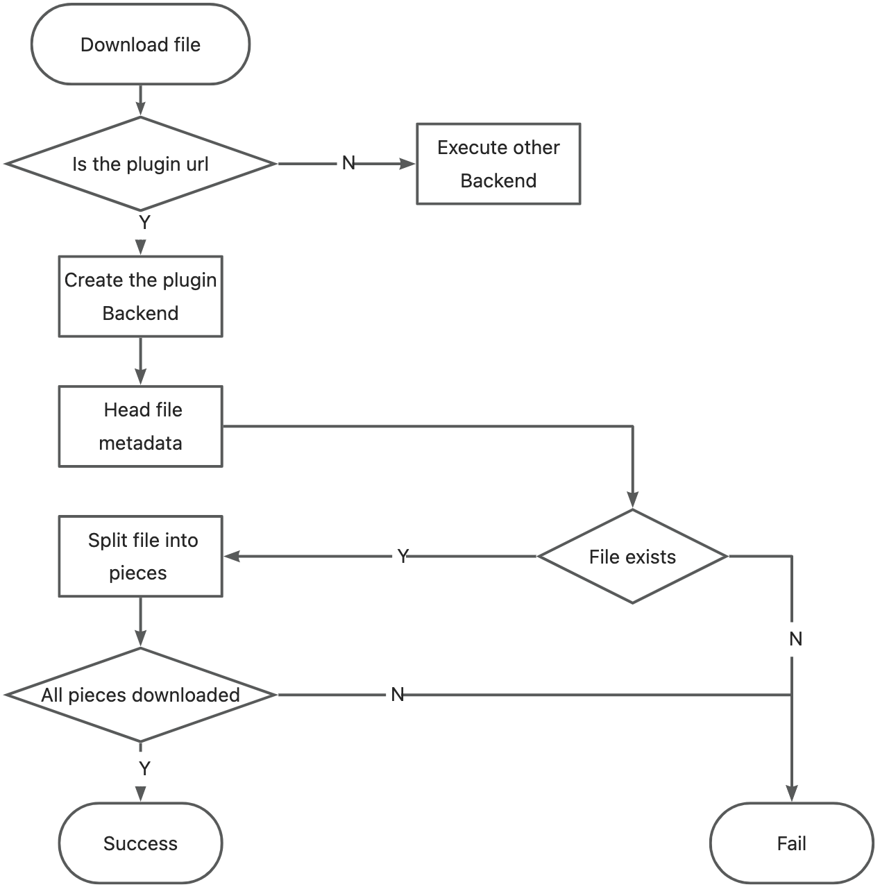
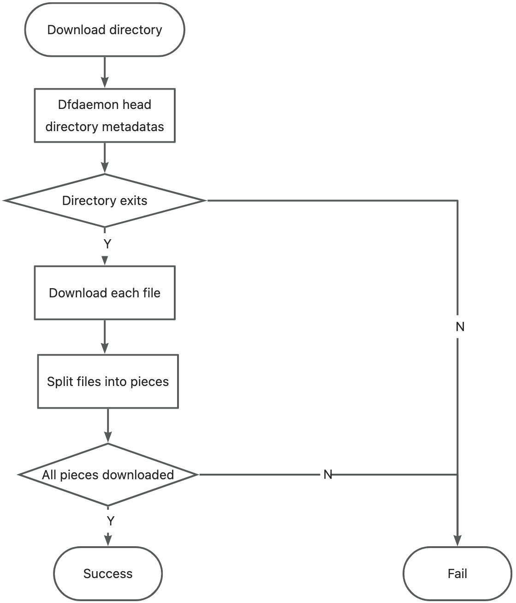

# plugin

### Introduction

This document describes the use of a plugin for the Dragonlfy client backend. It instructs developers to use the plugin to enable Dragonfly to support additional backends, such as dfs, without having to break into Dragonlfy to make code changes.

### Usage

The plugin for backend works as a `lib{plugin-name}.so` dynamic link library. Here are the steps to use it:

**1. Plugin put in the specified path**

After the plugin is built, it needs to be stored in the `/usr/local/lib/dragonfly/plugins/dfdaemon/backend` path by default. This can be changed in [dfdaemon config](https://d7y.io/docs/next/reference/configuration/client/dfdaemon/).

Dfdaemon loads plugins only at startup, so you need to restart dfdaemon after adding a new plugin.

**2. Dfdaemon loading plugin**

When dfdaemon starts, the following logs are included in the dfdaemon startup log, which means that the plugin was loaded successfully.

```
INFO  load [<plugin-name>] plugin backend
```

**3. Use the plugin to download files**

After the plugin is successfully loaded, you can use dfget to download the file:

```shell
dfget <plugin-name>://<host>:<port>/<path> --output /tmp/file.txt
```

### Details

Before development, please refer to [Dragonfly Client](https://github.com/dragonflyoss/client/tree/main) for the [dragonfly-client-backend/examples/plugin](https://github.com/dragonflyoss/client/tree/main/dragonfly-client-backend/examples/plugin) module.

There is no need to change the code of Dragonfly Client during development. Two interfaces of Backend is important for you to implemet, `head` and `get`.

`head` is used to get metadata information about the task.

- For single file downloads, this refers to retrieving metadata such as the file size.

- For directory downloads, it retrieves information about all files in the current directory and its subdirectories, including their file paths and sizes.

```rust
async fn head(&self, request: HeadRequest) -> Result<HeadResponse> {
    ...
}
```

`get` is used to download the corresponding piece of task.

```rust
async fn get(&self, request: GetRequest) -> Result<GetResponse<Body>> {
    ...
}
```

### Workflow

**Plugin Registration**

Upon startup, dfdaemon scans the plugin path. If plugins are found, they are registered; otherwise, this step is skipped.


**Download File**

During file download, dfdaemon first heads the file size through plugin. The file is then divided into multiple pieces based on its size, and each piece establishes an independent download task through the plugin.



**Download Directory**

When downloading a directory, dfget use dfdaemon first head metadata for all files within that directory, including their url path and size. If the user specifies the `include-files` parameter, dfget filters for the files. Finally, it iterates through each remaining file to establish individual download requests.


