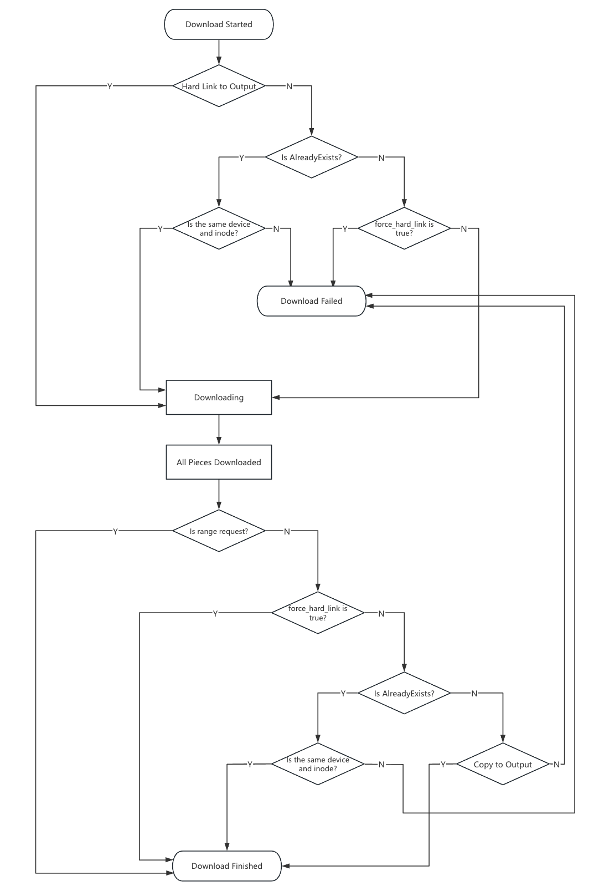

# File Download Workflow with Hard Link

## Introduction

File download needs to be done in a way that is efficient and secure. If users are downloading a large file,
it is not efficient to download the file and copy to the output path. Instead, we can create a hard link to the
file and send the link to the user. This way, we can avoid copying the file and save time and resources.
If hard link fails (e.g. due to different file systems), dfdaemon will fallback to copying the file.

## Details

GRPC adds two parameters for file download: `outpu_path` and `force_hard_link` in Download message.

**_Case 1_**: `output_path` is None. In this case, the file is downloaded to the storage directory of the dfdaemon.

**_Case 2_**: `output_path` is not None and `force_hard_link` is false. In this case, the file is downloaded to
the storage directory of the dfdaemon and create a hard link to the output path. If hard link
fails(e.g. due to different file systems), dfdaemon will fallback to copying the file.

**_Case 3_**: `output_path` is not None and `force_hard_link` is true. In this case, the file is downloaded to the
storage directory of the dfdaemon and create a hard link to the output path. If hard link
fails(e.g. due to different file systems), the download will be failed.

### Workflow

- Hard link will be created when the file is downloaded started, because the file is not downloaded finished yet.
  It can be read by the user when the file is downloaded finished.
- Copy the file will be done when the file is downloaded finished.
