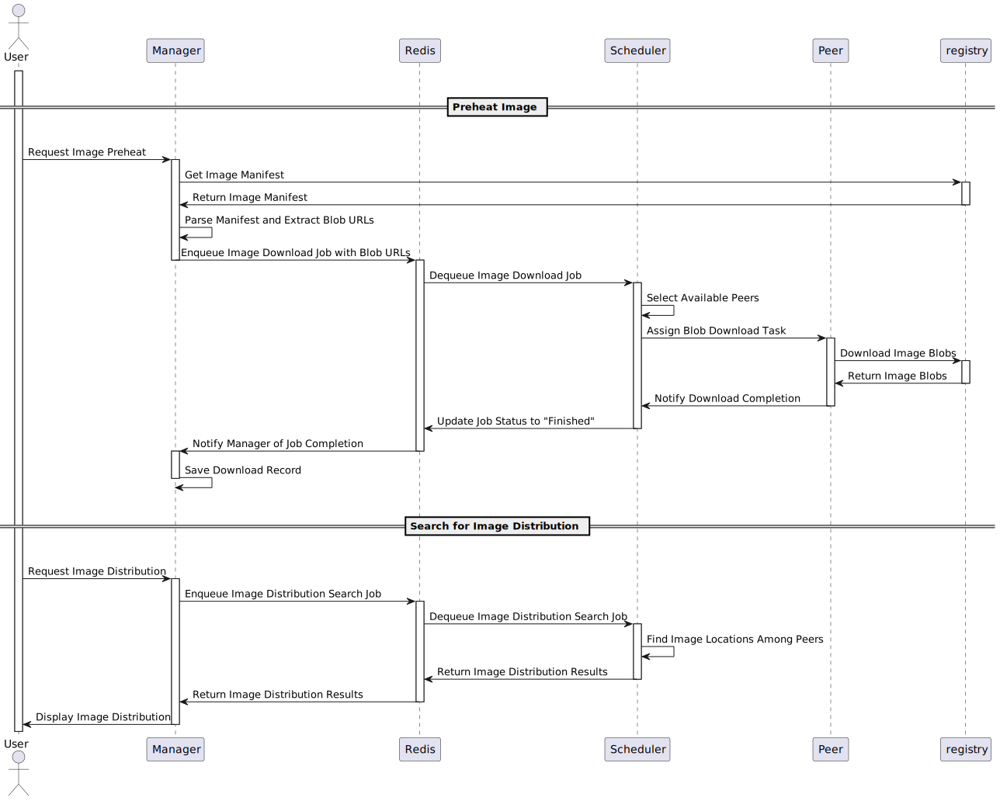

# Preheat

## Preheat Image

### Introduction

This document describes the functional design for the Image Preheat and Image Distribution Search
processes based on the provided UML sequence diagram. The system enables users to request image preheating
(downloading image blobs to peers) and search for image distribution across peers.

### Functional Components

- User: Initiates requests for image preheating and distribution searches.
- Manager: Central component that handles user requests, interacts with Redis, and manages job records.
- Redis: Acts as a job queue and storage for job status and results.
- Scheduler: Manages job dequeuing and assigns tasks to available peers.
- Peer: Downloads image blobs from the Registry and reports task completion.
- Registry: Stores and provides image manifests and blobs.

### Sequence Diagram

### System Interactions

Manager ↔ Registry: Fetches image manifests and blob URLs.

Manager ↔ Redis: Enqueues jobs and receives job completion notifications.

Redis ↔ Scheduler: Dequeues jobs and updates job statuses.

Scheduler ↔ Peer: Assigns download tasks and receives completion notifications.

Peer ↔ Registry: Downloads image blobs.

Manager ↔ User: Receives user requests and returns search results.
