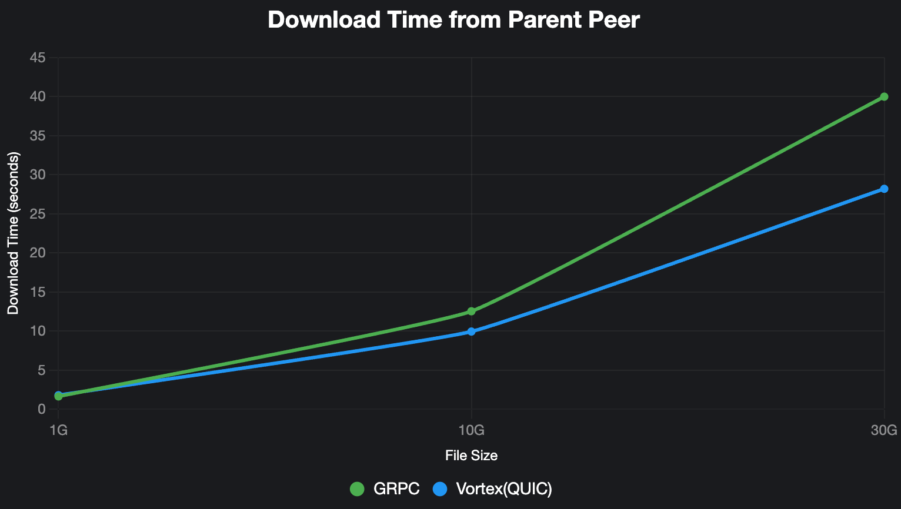
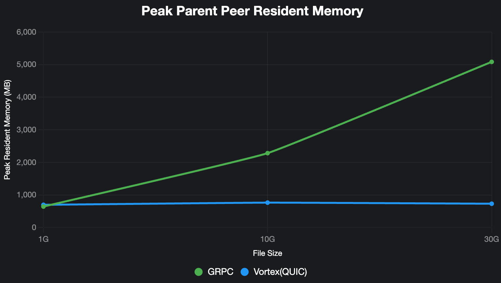

# QUIC Protocol Support for P2P File Transfer

## Overview

This design document proposes adding QUIC protocol support to Dragonfly's P2P file transfer mechanism. Currently, Dragonfly only supports gRPC protocol for peer-to-peer communication. Adding QUIC support will provide a more lightweight transport option that may offer better performance in certain network environments.

## Motivation

- **Performance**: 0-RTT connection reduces stack overhead compared to gRPC
- **Flexibility**: Multiple transport protocols increase network adaptability
- **Compatibility**: QUIC support enables better compatibility with diverse network environments
- **Optimization**: Opportunity for protocol-specific optimizations for large files/AI models

## Goals

1. Add QUIC protocol support while maintaining backward compatibility with existing gRPC implementation
2. Preserve the existing `Downloader` interface for seamless integration
3. Support Dragonfly's Vortex application-layer protocol over QUIC
4. Optimize for large file transfers and maximize network bandwidth utilization

## Architecture

```
DownloaderFactory -> Downloader (Interface) -> {
    GRPCDownloader,
    QUICDownloader
}
```

### Modules

```
dragonfly-client-storage/src/
├── client/
│   ├── mod.rs          # Client trait definition
│   └── quic.rs         # QUICClient implementation
└── server/
    ├── mod.rs          # Server trait definition
    └── quic.rs         # QUICServer implementation
```

- `piece_downloader.rs`: Add QUIC support to DownloaderFactory
- `dfdaemon/main.rs`: Add protocol configuration parsing
- Configuration file: Add `storage.server.protocol` option

## Implementation

### Client

```rust
#[async_trait]
/// StorageClient is the client for downloading pieces from other peers.
pub struct StorageClient {
    /// config is the configuration of the dfdaemon.
    config: Arc<Config>,
}

impl StorageClient {
    /// new creates a new storage client.
    pub fn new(config: Arc<Config>) -> Self {
        Self { config }
    }

    /// download_piece downloads a piece from a peer.
    #[instrument(skip_all)]
    pub async fn download_piece(
        &self,
        peer_id: &str,
        task_id: &str,
        piece_id: &str,
        range: Option<Range>,
    ) -> Result<impl AsyncRead> {
        match self.config.storage.server.protocol.as_str() {
            "grpc" => self.download_piece_via_grpc(peer_id, task_id, piece_id, range).await,
            "quic" => self.download_piece_via_quic(peer_id, task_id, piece_id, range).await,
            _ => Err(Error::InvalidParameter),
        }
    }

    /// download_piece_via_quic downloads a piece via QUIC.
    #[instrument(skip_all)]
    async fn download_piece_via_quic(
        &self,
        peer_id: &str,
        task_id: &str,
        piece_id: &str,
        range: Option<Range>,
    ) -> Result<impl AsyncRead> {
        // TODO: Implement QUIC client for downloading pieces
        Err(Error::NotImplemented)
    }
}
```

### Vortex Protocol

The QUIC implementation will support Dragonfly's Vortex protocol, refer to
<https://github.com/dragonflyoss/vortex-protocol>.

### QUIC Downloader

```rust
pub struct QUICDownloader {
    config: Arc<Config>,
    clients: Arc<Mutex<HashMap<String, QUICClientEntry>>>,
    capacity: usize,
    idle_timeout: Duration,
    cleanup_at: Arc<Mutex<Instant>>,
}

struct QUICClientEntry {
    client: QUICClient,
    active_requests: Arc<AtomicUsize>,
    actived_at: Arc<std::sync::Mutex<Instant>>,
}

#[async_trait]
impl Downloader for QUICDownloader {
    async fn download_piece(
        &self,
        addr: &str,
        number: u32,
        host_id: &str,
        task_id: &str,
    ) -> Result<(Cursor<Vec<u8>>, u64, String)> {
        // 1. Get or create QUIC client for addr
        // 2. Send download_piece request via Vortex protocol
        // 3. Receive and validate response
        // 4. Return piece data with metadata
    }
}
```

### Performance

The congestion control algorithm used Bottleneck Bandwidth and Round-trip propagation time(BBR) for QUIC protocols.

<!-- markdownlint-disable -->

| Protocol     | File Size | Download Time from Parent Peer | CPU/MEM | Piece Concurrency | Peak Memory                                                         | Parent Peer Peak Memory                                              |
| ------------ | --------- | ------------------------------ | ------- | ----------------- | ------------------------------------------------------------------- | -------------------------------------------------------------------- |
| GRPC         | 30G       | 40.001s                        | 16C32G  | 32                | Peak Virtual Memory: 5236392 kB<br>Peak Resident Memory: 2151256 kB | Peak Virtual Memory: 12174728 kB<br>Peak Resident Memory: 5206904 kB |
| Vortex(QUIC) | 30G       | 28.214s                        | 16C32G  | 32                | Peak Virtual Memory: 3021500 kB<br>Peak Resident Memory: 1047568 kB | Peak Virtual Memory: 3002448 kB<br>Peak Resident Memory: 749596 kB   |
| GRPC         | 10G       | 12.543s                        | 16C32G  | 32                | Peak Virtual Memory: 3731144 kB<br>Peak Resident Memory: 1506620 kB | Peak Virtual Memory: 7200984 kB<br>Peak Resident Memory: 2338528 kB  |
| Vortex(QUIC) | 10G       | 9.950s                         | 16C32G  | 32                | Peak Virtual Memory: 2745432 kB<br>Peak Resident Memory: 971068 kB  | Peak Virtual Memory: 2987628 kB<br>Peak Resident Memory: 783688 kB   |
| GRPC         | 1G        | 1.651s                         | 16C32G  | 32                | Peak Virtual Memory: 1257368 kB<br>Peak Resident Memory: 425688 kB  | Peak Virtual Memory: 2663160 kB<br>Peak Resident Memory: 660344 kB   |
| Vortex(QUIC) | 1G        | 1.806s                         | 16C32G  | 32                | Peak Virtual Memory: 2595516 kB<br>Peak Resident Memory: 294344 kB  | Peak Virtual Memory: 2744732 kB<br>Peak Resident Memory: 715704 kB   |

#### Download Time from Parent Peer



#### Peak Parent Peer Resident Memory



<!-- markdownlint-restore -->

### Configuration

Add QUIC protocol configuration to `dfdaemon.yaml`:

```yaml
download:
  protocol: quic

storage:
  server:
    ip: 0.0.0.0
    quic_port: 4005
```

## Testing

1. **Unit Tests**: Individual component testing with 85%+ coverage
2. **Integration Tests**: End-to-end functionality verification
3. **Performance Tests**: QUIC vs gRPC benchmarking
4. **Stress Tests**: High concurrency and long-duration testing

## Compatibility

- **Backward Compatibility**: Existing gRPC functionality remains unchanged
- **Configuration**: New QUIC options with sensible defaults
- **Migration**: Users can switch protocols via configuration without code changes

## Future

- **Protocol Negotiation**: Automatic protocol selection based on network conditions
- **Hybrid Mode**: Simultaneous multi-protocol support for optimal performance

---

This design provides a foundation for adding QUIC protocol support to Dragonfly while maintaining system stability and backward compatibility.
