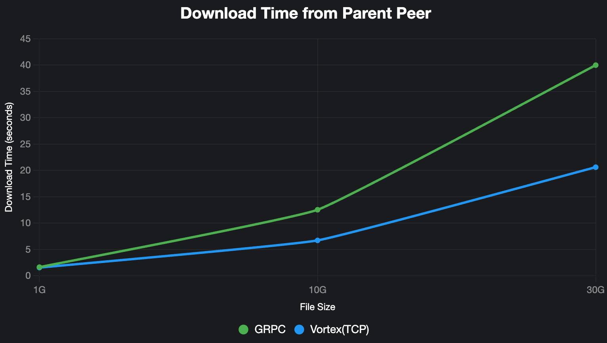
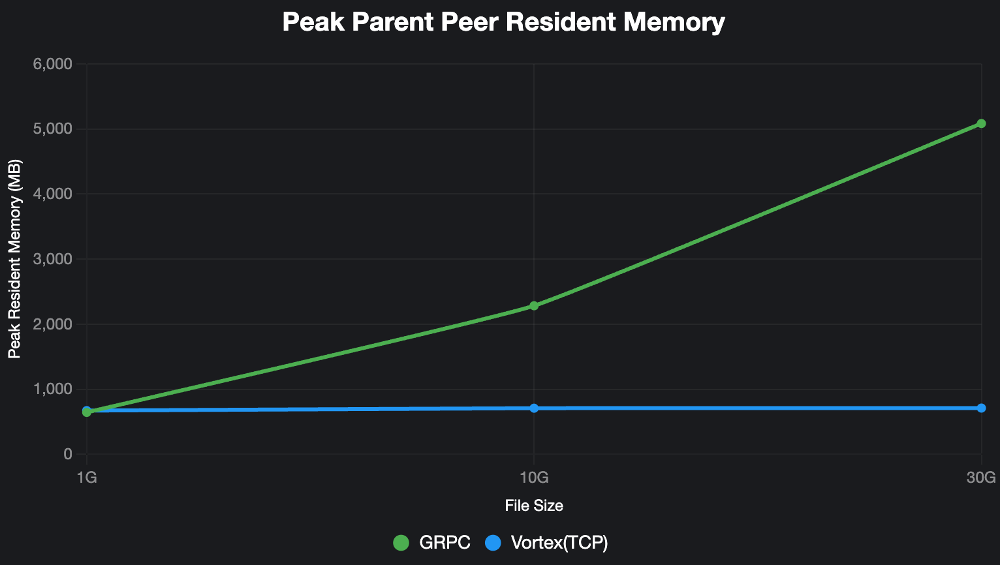

# TCP Protocol Support for P2P File Transfer

## Overview

This design document proposes adding TCP protocol support to Dragonfly's P2P file transfer mechanism. Currently, Dragonfly only supports gRPC protocol for peer-to-peer communication. Adding TCP support will provide a more lightweight transport option that may offer better performance in certain network environments.

## Motivation

- **Performance**: TCP direct connection reduces protocol stack overhead compared to gRPC
- **Flexibility**: Multiple transport protocols increase network adaptability
- **Compatibility**: TCP support enables better compatibility with diverse network environments
- **Optimization**: Opportunity for protocol-specific optimizations for large files/AI models

## Goals

1. Add TCP protocol support while maintaining backward compatibility with existing gRPC implementation
2. Preserve the existing `Downloader` interface for seamless integration
3. Support Dragonfly's Vortex application-layer protocol over TCP
4. Optimize for large file transfers and maximize network bandwidth utilization

## Architecture

```
DownloaderFactory -> Downloader (Interface) -> {
    GRPCDownloader,
    TCPDownloader
}
```

### Modules

```
dragonfly-client-storage/src/
├── client/
│   ├── mod.rs          # Client trait definition
│   └── tcp.rs          # TCPClient implementation
└── server/
    ├── mod.rs          # Server trait definition
    └── tcp.rs          # TCPServer implementation
```

- `piece_downloader.rs`: Add TCP support to DownloaderFactory
- `dfdaemon/main.rs`: Add protocol configuration parsing
- Configuration file: Add `storage.server.protocol` option

## Implementation

### Client

```rust
#[async_trait]
pub trait Client: Send + Sync {
    type Config;
    type Error;

    async fn new(
        config: Self::Config,
        addr: String,
        is_download_piece: bool
    ) -> Result<Self, Self::Error> where Self: Sized;

    async fn download_piece(
        &self,
        request: DownloadPieceRequest,
        timeout: Duration,
    ) -> Result<DownloadPieceResponse, Self::Error>;

    async fn download_persistent_cache_piece(
        &self,
        request: DownloadPersistentCachePieceRequest,
        timeout: Duration,
    ) -> Result<DownloadPersistentCachePieceResponse, Self::Error>;
}
```

### Vortex Protocol

The TCP implementation will support Dragonfly's Vortex protocol, refer to
<https://github.com/dragonflyoss/vortex-protocol>.

### TCP Downloader

```rust
pub struct TCPDownloader {
    config: Arc<Config>,
    clients: Arc<Mutex<HashMap<String, TCPClientEntry>>>,
    capacity: usize,
    idle_timeout: Duration,
    cleanup_at: Arc<Mutex<Instant>>,
}

struct TCPClientEntry {
    client: TCPClient,
    active_requests: Arc<AtomicUsize>,
    actived_at: Arc<std::sync::Mutex<Instant>>,
}

#[async_trait]
impl Downloader for TCPDownloader {
    async fn download_piece(
        &self,
        addr: &str,
        number: u32,
        host_id: &str,
        task_id: &str,
    ) -> Result<(Cursor<Vec<u8>>, u64, String)> {
        // 1. Get or create TCP client for addr
        // 2. Send download_piece request via Vortex protocol
        // 3. Receive and validate response
        // 4. Return piece data with metadata
    }
}
```

### Configuration

Add TCP protocol configuration to `dfdaemon.yaml`:

```yaml
download:
  protocol: tcp

storage:
  server:
    ip: 0.0.0.0
    tcp_port: 4005
```

### Performance

The congestion control algorithm used Bottleneck Bandwidth and Round-trip propagation time(BBR) for TCP protocols.

<!-- markdownlint-disable -->

| Protocol    | File Size | Download Time from Parent Peer | CPU/MEM | Piece Concurrency | Peak Memory                                                         | Parent Peer Peak Memory                                              |
| ----------- | --------- | ------------------------------ | ------- | ----------------- | ------------------------------------------------------------------- | -------------------------------------------------------------------- |
| GRPC        | 30G       | 40.001s                        | 16C32G  | 32                | Peak Virtual Memory: 5236392 kB<br>Peak Resident Memory: 2151256 kB | Peak Virtual Memory: 12174728 kB<br>Peak Resident Memory: 5206904 kB |
| Vortex(TCP) | 30G       | 20.626s                        | 16C32G  | 32                | Peak Virtual Memory: 2435020 kB<br>Peak Resident Memory: 561364 kB  | Peak Virtual Memory: 2835012 kB<br>Peak Resident Memory: 728256 kB   |
| GRPC        | 10G       | 12.543s                        | 16C32G  | 32                | Peak Virtual Memory: 3731144 kB<br>Peak Resident Memory: 1506620 kB | Peak Virtual Memory: 7200984 kB<br>Peak Resident Memory: 2338528 kB  |
| Vortex(TCP) | 10G       | 6.726s                         | 16C32G  | 32                | Peak Virtual Memory: 2544092 kB<br>Peak Resident Memory: 675212 kB  | Peak Virtual Memory: 2707524 kB<br>Peak Resident Memory: 726016 kB   |
| GRPC        | 1G        | 1.651s                         | 16C32G  | 32                | Peak Virtual Memory: 1257368 kB<br>Peak Resident Memory: 425688 kB  | Peak Virtual Memory: 2663160 kB<br>Peak Resident Memory: 660344 kB   |
| Vortex(TCP) | 1G        | 1.562s                         | 16C32G  | 32                | Peak Virtual Memory: 1164812 kB<br>Peak Resident Memory: 231308 kB  | Peak Virtual Memory: 2699596 kB<br>Peak Resident Memory: 688820 kB   |

#### Download Time from Parent Peer



#### Peak Parent Peer Resident Memory



<!-- markdownlint-restore -->

## Testing

1. **Unit Tests**: Individual component testing with 85%+ coverage
2. **Integration Tests**: End-to-end functionality verification
3. **Performance Tests**: TCP vs gRPC benchmarking
4. **Stress Tests**: High concurrency and long-duration testing

## Compatibility

- **Backward Compatibility**: Existing gRPC functionality remains unchanged
- **Configuration**: New TCP options with sensible defaults
- **Migration**: Users can switch protocols via configuration without code changes

## Future

- **Protocol Negotiation**: Automatic protocol selection based on network conditions
- **Hybrid Mode**: Simultaneous multi-protocol support for optimal performance

---

This design provides a foundation for adding TCP protocol support to Dragonfly while maintaining system stability and backward compatibility.
