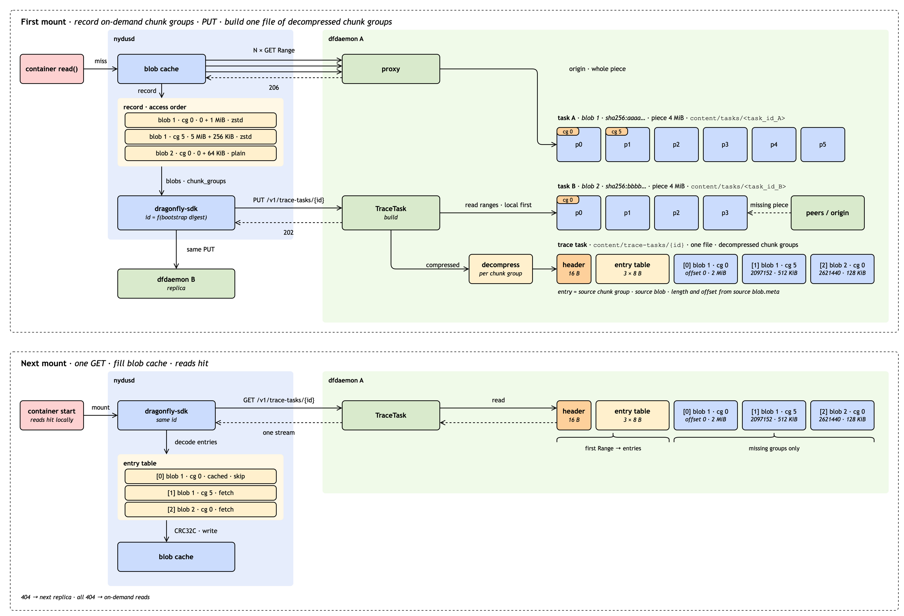
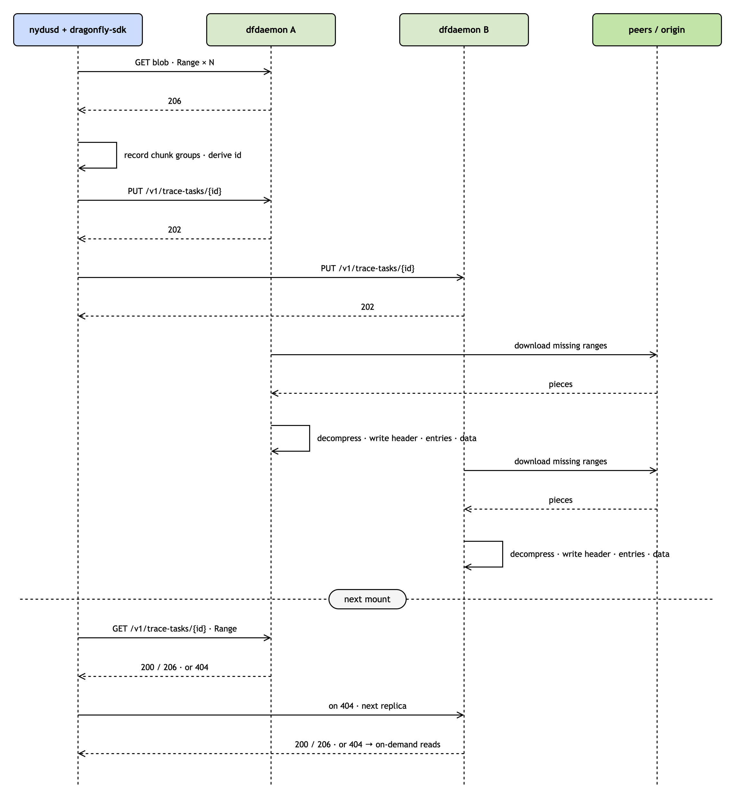
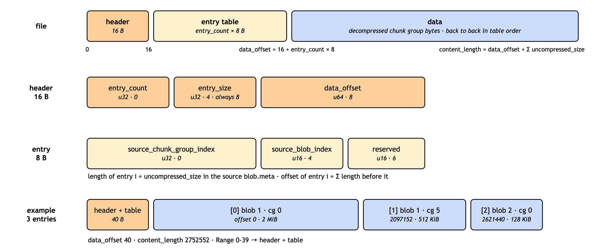
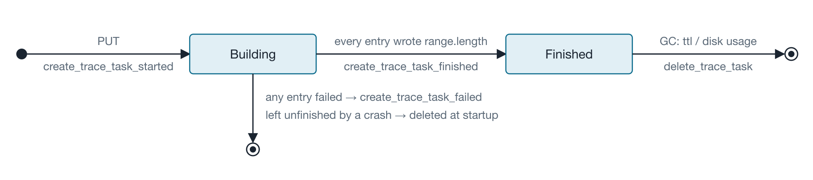
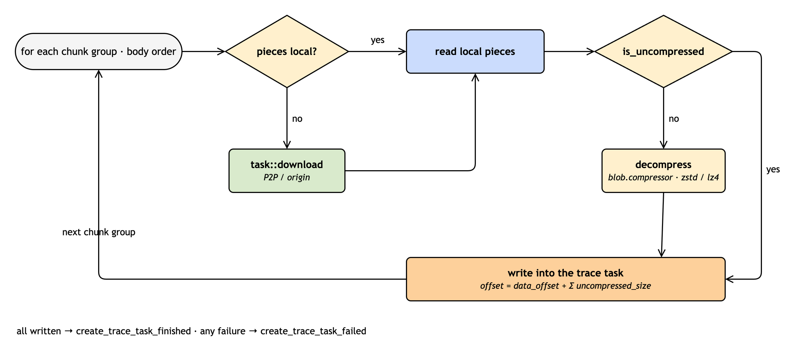

# Trace Task

## Overview

TraceTask is a new task type of the Dragonfly client for nydus. nydusd records the chunk groups it reads on
demand during one run and uploads the list to dfdaemon. dfdaemon fetches the missing bytes, decompresses each
chunk group and stores them in access order as one local file. On the next mount nydusd downloads that file as
one HTTP stream with `Range` and fills its blob cache, so a cold start issues one request instead of thousands.

## Goals

1. Add `TraceTask`, a local file task served over HTTP with `Range`, built from the chunk groups a nydusd read.
2. Reuse the existing storage, garbage collection and proxy patterns; no change to `dragonfly-api` or the configuration.
3. Derive the task id on the client so uploads are idempotent and downloads need no lookup; replicate in `dragonfly-sdk`.

## Architecture



The trace task is a plain file next to the tasks it was built from and is never announced to the scheduler.
The SDK uploads to two dfdaemons chosen by hash ring and falls back between them on `404`.



### Modules

```text
dragonfly-client-storage/src
|-metadata.rs                 // TraceTask metadata
|-content.rs                  // DEFAULT_TRACE_TASK_DIR
|-content_linux.rs            // create/write/read/delete the trace task file
|-content_macos.rs            // same for macOS
|-lib.rs                      // Storage wrappers

dragonfly-client/src
|-resource/trace_task.rs      // upload, build, download; header and entry codec
|-proxy/trace_task.rs         // HTTP handler
|-proxy/mod.rs                // dispatch /v1/trace-tasks/
|-proxy/header.rs             // X-Dragonfly-Nydusd-ID
|-gc/mod.rs                   // eviction
|-bin/dfdaemon/main.rs        // wiring

dragonfly-client-metric/src
|-lib.rs                      // metrics

dragonfly-sdk/client-request
|-rust/src/id_generator.rs    // trace_task_id, nydusd_id
|-rust/src/lib.rs             // put_trace_task, get_trace_task, decode_trace_task_entries
|-go/...                      // Go parity, consistency vectors
```

## Implementation

### API

nydusd calls the dfdaemon proxy port (default `4001`) directly. Both endpoints require `X-Dragonfly-Nydusd-ID`,
generated once per nydusd process like `peer_id` and used only in spans and logs. The id in the path is derived
by the SDK; dfdaemon only checks `^[0-9a-f]{64}$`.

```rust
pub fn nydusd_id(&self) -> String {
    format!("{}-{}-{}", self.ip, self.hostname, Uuid::new_v4())
}

/// bootstrap_digest: SHA256 of the bootstrap file passed to `nydus fuse --bootstrap`, lowercase hex.
pub fn trace_task_id(&self, bootstrap_digest: &str) -> String {
    hex::encode(Sha256::digest(format!("{bootstrap_digest}-trace-task")))
}
```

#### PUT /v1/trace-tasks/{id}

```http
PUT /v1/trace-tasks/3f0c…e9a1 HTTP/1.1
Content-Type: application/json
X-Dragonfly-Nydusd-ID: 10.0.0.8-node-1-7c1e…9f2b

{"blobs":[
  {"source_blob_index":1,
   "url":"https://registry.example.com/v2/app/blobs/sha256:aaaa…",
   "header":{"Authorization":"Bearer …"},
   "compressor":"zstd",
   "chunk_groups":[
     {"source_chunk_group_index":0,
      "compressed_offset":0,"compressed_size":1048576,
      "uncompressed_size":2097152,"is_uncompressed":false},
     {"source_chunk_group_index":5,
      "compressed_offset":5242880,"compressed_size":262144,
      "uncompressed_size":524288,"is_uncompressed":false}
   ]},
  {"source_blob_index":2,
   "url":"https://registry.example.com/v2/app/blobs/sha256:bbbb…",
   "header":{"Authorization":"Bearer …"},
   "compressor":"zstd",
   "chunk_groups":[
     {"source_chunk_group_index":0,
      "compressed_offset":0,"compressed_size":131072,
      "uncompressed_size":131072,"is_uncompressed":true}
   ]}
]}
```

```rust
pub struct UploadTraceTaskRequest {
    pub blobs: Vec<UploadTraceTaskBlob>,
}

pub struct UploadTraceTaskBlob {
    pub source_blob_index: u16,
    pub url: String,
    pub header: HashMap<String, String>,
    pub compressor: TraceTaskCompressor,
    pub chunk_groups: Vec<UploadTraceTaskChunkGroup>,
}

pub struct UploadTraceTaskChunkGroup {
    pub source_chunk_group_index: u32,
    pub compressed_offset: u64,
    pub compressed_size: u32,
    pub uncompressed_size: u32,
    pub is_uncompressed: bool,
}

pub enum TraceTaskCompressor { None, Zstd, Lz4Block }   // "none" | "zstd" | "lz4"
```

| Field                                | Meaning                                                                     |
| ------------------------------------ | --------------------------------------------------------------------------- |
| `url`, `header`                      | The request dfdaemon uses to download the blob                              |
| `compressor`                         | The blob's chunk group compressor, same set as nydus `BlobMetadataCompressor` |
| `compressed_offset`, `compressed_size` | The group's bytes in the blob                                             |
| `uncompressed_size`                  | Decoded length; an LZ4 block has no frame header and needs it               |
| `is_uncompressed`                    | The group is stored plain; nydus skips compression that does not shrink     |
| `source_blob_index`, `source_chunk_group_index` | Copied into the entry table in body order                        |

The upload is idempotent on `id`: the first upload wins until the task is evicted, a repeated `PUT` returns the
current state.

| Status | Condition                                                                                                     |
| ------ | ------------------------------------------------------------------------------------------------------------- |
| 202    | Created or building                                                                                           |
| 200    | Finished                                                                                                      |
| 400    | Invalid id or `X-Dragonfly-Nydusd-ID`; empty `blobs` or `chunk_groups`; url scheme not http/https; zero `compressed_size` or `uncompressed_size`; `is_uncompressed` with `compressed_size != uncompressed_size`; unknown `compressor`; malformed JSON |
| 413    | Body larger than 4 MiB or more than 8192 chunk groups                                                         |
| 507    | Not enough disk space                                                                                         |

#### GET /v1/trace-tasks/{id}

```http
GET /v1/trace-tasks/3f0c…e9a1 HTTP/1.1
X-Dragonfly-Nydusd-ID: 10.0.0.8-node-1-7c1e…9f2b
Range: bytes=0-39

HTTP/1.1 206 Partial Content
Content-Type: application/octet-stream
Accept-Ranges: bytes
Content-Range: bytes 0-39/2752552
Content-Length: 40
X-Dragonfly-Server-IP: 10.0.0.12
```

| Status    | Condition                                                           |
| --------- | ------------------------------------------------------------------- |
| 200 / 206 | Finished; a single `Range` is honored                               |
| 404       | Not found or still building                                         |
| 416       | Range not satisfiable, `Content-Range: bytes */{content_length}`    |
| 400       | Invalid id or `X-Dragonfly-Nydusd-ID`                               |
| 405       | Any method other than `PUT` and `GET`                               |

A read failure closes the connection; there is no partial success.

### Content Format



Fixed-size header, fixed-size entry table, then the decompressed chunk groups back to back in table order.
All integers are little-endian. An entry names only the source group: its length is the `uncompressed_size` in
the source blob.meta and its offset is the sum of the lengths before it. The file is a pure function of the
request body, so replicas are byte-identical. nydus verifies each group with the source blob.meta at replay.

```rust
pub const TRACE_TASK_HEADER_SIZE: usize = 16;
pub const TRACE_TASK_ENTRY_SIZE: usize = 8;

pub struct TraceTaskHeader {
    pub entry_count: u32,
    pub entry_size: u32,
    pub data_offset: u64,
}

pub struct TraceTaskEntry {
    pub source_chunk_group_index: u32,
    pub source_blob_index: u16,
    pub reserved: u16,
}
```

### Storage

One file at `{content_dir}/trace-tasks/{id}`, no pieces. The metadata tracks lifecycle and upload counters;
the entry table lives only in the file.

```rust
// dragonfly-client-storage/src/metadata.rs
#[derive(Debug, Clone, Default, Serialize, Deserialize)]
pub struct TraceTask {
    pub id: String,
    pub content_length: u64,
    pub uploading_count: i64,
    pub uploaded_count: u64,
    pub updated_at: NaiveDateTime,
    pub created_at: NaiveDateTime,
    pub finished_at: Option<NaiveDateTime>,
}

impl DatabaseObject for TraceTask {
    const NAMESPACE: &'static str = "trace_task";
}

fn is_finished() -> bool;
fn is_uploading() -> bool;
fn is_expired(ttl) -> bool;

fn create_trace_task_started(id, content_length) -> TraceTask;
fn create_trace_task_finished(id) -> TraceTask;
fn upload_trace_task_started(id);
fn upload_trace_task_finished(id);
fn get_trace_task(id) -> Option<TraceTask>;
fn get_trace_tasks() -> Vec<TraceTask>;
fn delete_trace_task(id);
```

```rust
// dragonfly-client-storage/src/content_{linux,macos}.rs
pub const DEFAULT_TRACE_TASK_DIR: &str = "trace-tasks";

async fn create_trace_task(id, content_length) -> PathBuf;    // fallocate
async fn write_trace_task(id, offset, length, reader);
async fn read_trace_task(id, range) -> RangeReader;
async fn delete_trace_task(id);
```

```rust
// dragonfly-client-storage/src/lib.rs
async fn create_trace_task_started(id, content_length) -> TraceTask;
async fn write_trace_task(id, offset, length, reader);
fn create_trace_task_finished(id) -> TraceTask;
async fn create_trace_task_failed(id);                        // delete
async fn upload_trace_task(id, range) -> (TraceTask, RangeReader);  // counts uploading, like upload_piece
fn get_trace_task(id) -> Option<TraceTask>;
fn get_trace_tasks() -> Vec<TraceTask>;
async fn delete_trace_task(id);
```

The `trace_task` column family is created on first start; no migration.

### Resource



```rust
// dragonfly-client/src/resource/trace_task.rs
pub struct TraceTask {
    config: Arc<Config>,
    storage: Arc<Storage>,
    task: Arc<Task>,
    create: tokio::sync::Mutex<()>,   // serializes get -> create_started
}

pub enum UploadTraceTaskState { Accepted, Exists }

async fn upload(id, request, dynconfig, remote_ip) -> UploadTraceTaskState;
async fn download(id, range) -> Option<(TraceTask, RangeReader)>;
async fn build(id, blobs, dynconfig, remote_ip);
```

#### Upload

1. Validate; encode the header and the entry table; `content_length = data_offset + Σ uncompressed_size`.
2. Under the `create` lock, `get_trace_task(id)`: finished → `Exists`; building → `Accepted`.
3. `has_enough_space`, `create_trace_task_started`, release the lock.
4. `tokio::spawn(build)`, return `Accepted`.

No network I/O before the response. A building row always belongs to a live `build`; rows left by a crash are
deleted at startup, so no timeout is needed.

#### Build



1. Write the header and the entry table at offset 0.
2. One download request per chunk group, same fields as a proxied `GET`:

   | Field            | Value                                                       |
   | ---------------- | ----------------------------------------------------------- |
   | `url`            | the blob's `url`                                            |
   | `range`          | `Range { start: compressed_offset, length: compressed_size }` |
   | `request_header` | the blob's `header` without `Host` and `Range`              |
   | `prefetch`       | `false`                                                     |

   The task id matches the task written when nydusd read the range through the proxy, so local pieces are
   found without a scheduler round trip.
3. `stream::iter(requests).map(download).buffered(concurrent_piece_count)`; output stays in order.
4. Consume each session with `write_pieces_in_order`, shared with the proxy; the sink collects the group's bytes.
5. Unless `is_uncompressed`, decode with the blob's `compressor`; the result must be `uncompressed_size` bytes.
   Write at `data_offset + Σ previous uncompressed_size`. No checksum; nydus verifies at replay.
   Any failure → `create_trace_task_failed` (row and file deleted); all written → `create_trace_task_finished`.

#### Download

1. `get_trace_task(id)`; anything but finished → `404`.
2. `parse_range_header(value, content_length)`; failure → `416`.
3. `upload_trace_task(id, range)` → `RangeReader`.
4. `200` / `206` headers, then `send_reader`, shared with the proxy send loop.

### Proxy

```rust
// proxy handler, after rate limiting and before the registry mirror dispatch
if request.uri().host().is_none() && request.uri().path().starts_with(PATH_PREFIX) {
    return handler(config, trace_task, dynconfig, request, remote_ip).await;
}

// proxy/trace_task.rs
pub const PATH_PREFIX: &str = "/v1/trace-tasks/";
const MAX_CHUNK_GROUPS: usize = 8192;
const MAX_BODY_LENGTH: usize = 4 * 1024 * 1024;
```

The body is read through `Limited`. Decoding uses `zstd` and `lz4_flex`, the crates `nydus-storage` encodes with.
`X-Dragonfly-Nydusd-ID` joins the other `X-Dragonfly-*` headers and is a span field, not a metrics label.

### Garbage Collection

| Method                           | Rule                                                                                        |
| -------------------------------- | ------------------------------------------------------------------------------------------- |
| `evict_trace_task_by_ttl`        | `is_expired(gc.policy.task_ttl)` and not uploading                                          |
| `evict_trace_task_by_disk_usage` | Above the high watermark, evict finished tasks by `updated_at` to the low watermark, before tasks |
| Startup                          | Delete unfinished rows and their files                                                      |

### Metrics

| Metric                                               | Type      | Labels                                       |
| ---------------------------------------------------- | --------- | -------------------------------------------- |
| `dragonfly_client_trace_task_upload_total`           | counter   | `state` = started / finished / failed        |
| `dragonfly_client_trace_task_download_total`         | counter   | `state` = started / finished / failed, `hit` |
| `dragonfly_client_trace_task_build_duration_seconds` | histogram |                                              |

### SDK

```rust
pub struct PutTraceTaskRequest { pub id: String, pub nydusd_id: String, pub blobs: Vec<UploadTraceTaskBlob> }
pub struct GetTraceTaskRequest { pub id: String, pub nydusd_id: String, pub range: Option<Range> }

/// PUT to two replicas from the hash ring; Ok when any returns 200 or 202.
pub async fn put_trace_task(&self, request: PutTraceTaskRequest) -> Result<()>;

/// GET from the replicas in ring order; next replica on 404; Err(NotFound) when every replica returns 404.
pub async fn get_trace_task(&self, request: GetTraceTaskRequest) -> Result<GetResponse>;

pub fn decode_trace_task_entries(bytes: &[u8]) -> Result<Vec<TraceTaskEntry>>;
```

All `Range` reads of one replay go to the same replica. The Go module implements `TraceTaskID`, `NydusdID`,
`PutTraceTask`, `GetTraceTask` and `DecodeTraceTaskEntries` with shared consistency vectors.

### Nydus

1. After mount, record chunk groups read on demand in first-access order, grouped by blob with its `url`,
   request `header` and `compressor`.
2. `put_trace_task` once, after 10 s without an on-demand read or 5 min after mount, whichever comes first.
3. On the next mount, `GET` the header and the entry table, compute offsets from the source blob.meta, skip
   cached groups, fetch the rest by `Range` or as one stream, and hand each group to
   `fill_chunk_group_from_redirect`. `NotFound` or a short read falls back to on-demand reads.
