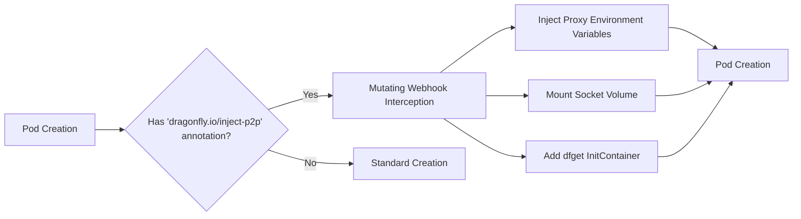

## Overview

This project introduces a Kubernetes Mutating Admission Webhook to Dragonfly's Helm Chart to automate P2P client injection. The Webhook dynamically injects Dragonfly configurations (e.g., proxy variables, volume mounts, dfget tools) into Pods based on annotations/labels. This eliminates manual YAML modifications, simplifying user adoption in Kubernetes environments.

## Technical Implementation

### Core Webhook Logic

The Mutating Webhook is registered via MutatingWebhookConfiguration to intercept Pod creations. Key injection features:

1. P2P Proxy Injection

   - Injects `DRAGONFLY_INJECT_PROXY` env-var into containers, dynamically constructing its value (e.g., `http://$(NODE_NAME):8001`).
   - Uses Downward API to fetch spec.nodeName/status.hostIP and Helm Chart values for the proxy port.

   2. dfdaemon Socket Mount
      Automatically adds a hostPath volume to expose the host's dfdaemon socket (default is `/var/run/dfdaemon.sock`) and mounts it to target containers.

2. dfget Tool Injection via InitContainer

   - Injects a multi-architecture initContainer to copy dfget into a shared emptyDir volume.
   - Updates the application container’s PATH to include the shared volume path. Uses Docker Manifest for auto-arch selection.

3. Helm Chart Deployment
   - Extends Dragonfly's Helm Chart with templates for:
   - Webhook Deployment/Service
   - RBAC (ClusterRole/RoleBinding)
   - MutatingWebhookConfiguration
   - Configuration via Helm Values (enable/disable, socket path, proxy port).

### Testing & Observability

- Unit Tests: Validate mutation logic for env-vars, volume mounts, and initContainers.
- E2E Tests: Verify end-to-end injection in Kind clusters.
- Logging: Structured logs for auditability and error tracing.

This approach standardizes P2P integration while maintaining compatibility across architectures and Kubernetes distributions.

## Workflow

