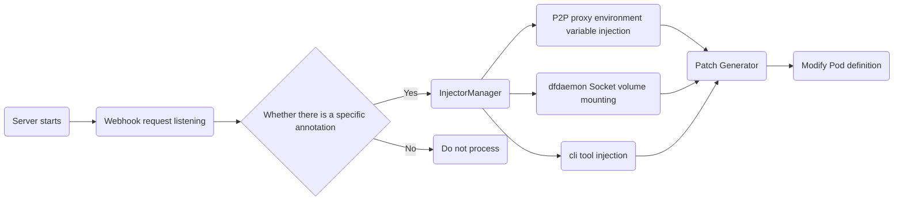

# Mutating Admission Webhook for Automatic P2P Injection in Dragonfly

## Overview

This document proposes the design of a Kubernetes Mutating Admission Webhook integrated into the official Dragonfly Helm Chart. The primary function of this webhook is to automate the injection of P2P capabilities into user Pods. It intercepts Pod creation requests and, based on specific annotations, automatically modifies the Pod's YAML definition to include necessary configurations like volumes, volume mounts, and environment variables. This approach will reduce the need for manual modifications to application manifests, significantly simplifying the use of Dragonfly in a Kubernetes environment.

## Motivation

- **Simplification**: Manually configuring Pods to use Dragonfly's P2P client (`dfget`) is complex, requiring specific knowledge of volumes, mounts, and container commands.

- **Error Reduction**: Automated injection prevents common manual configuration errors, improving reliability.

- **User Experience**: Lowers the barrier to entry for developers, making the integration of Dragonfly's P2P capabilities seamless and non-intrusive.

- **Consistency**: Ensures that all designated Pods receive a standardized and correct P2P configuration.

## Goals

1. Develop a core Mutating Admission Webhook service to automate the injection of P2P proxy settings, `dfdaemon` socket mounts, and binaries such as `dfget`.

2. Provide CI support, including `Dockerfiles` for building both the webhook service container image and its associated initContainer image.

3. Integrate the webhook deployment (Deployment, Service, RBAC, MutatingWebhookConfiguration) into the official Dragonfly Helm Chart.

4. Implement comprehensive unit and E2E tests for the core injection logic.

5. Produce clear user documentation detailing how to enable and configure the webhook.

## Architecture



## Modules

```bash
dragonfly-inject-p2p/
├── cmd/
│   └── main.go             # Entry point
├── deploy/
├── internal/
│   ├── config/
│   │   └── config.go       # Configuration management
│   ├── server/
│   │   └── server.go       # HTTP server
│   ├── handler/
│   │   └── handler.go      # Webhook request handling
│   ├── injector/
│   │   ├── manager/
│   │   │   └── manager.go  # Injection manager
│   │   ├── resource/
│   │   │   ├── proxy_injector.go   # P2P proxy injector
│   │   │   ├── socket_injector.go  # dfdaemon Socket volume mount injector
│   │   │   └── cli_injector.go     # cli tool injector
│   │   └── patch/
│   │       └── patch.go            # JSON Patch
│   └── util/
│       └── util.go         # Utility functions
├── scripts/                # Helper scripts
└── test/                   # Test code
    ├── unit/
    └── e2e/
```

## Implementation

### Config

```go
type Config struct {
    /* Some webhook server config*/

    //...

    /* Webhook Config*/
    // Proxy port for constructing P2P proxy environment variables
    ProxyPort string
    // Path to the dfdaemon socket file on the node for volume mounting
    DfdaemonSocketPath string
    // Version of the init container image containing the cli tool
    InitConatinerVersion string
    // Name of the shared volume for cli tool injection
    SharedVolumeName string
    // Mount path of the shared volume inside containers for cli access
    SharedVolumeMountPath string
    // Path to the cli tool within the init container
    InitContainerPath string
    // Annotation name to trigger the Webhook injection
    AnnotationName string
}
```

### Server

```go
type Server struct {
    /* Server config suach as IP and port*/

    //...

    handler Handler
}

func (s *Server) Start() {
    http.HandleFunc("/mutate", s.handler.HandleWebhook)
}
```

### Handler

```go
type Handler struct {
    injectorManager InjectorManager
}

func (h *Handler) HandleWebhook(w http.ResponseWriter, r *http.Request) {
    // parse pod from request
    // ...
    if /* pod has specific annotation*/ {
        mutatedPod := h.injectorManager.Inject(pod)
        patch := patch.GeneratePatch(pod, mutatedPod)
        /* send patch pod */
    } else {
        /* send Original pod */
    }
}
```

### InjectorManager

```go
type Injector interface {
    Inject(pod *corev1.Pod) *corev1.Pod
}
```

```go
type InjectorManager struct {
    config Config
    injectors []Injector
}

func (im *InjectorManager) Inject(pod *corev1.Pod) *corev1.Pod {
    for _, injector := range im.injectors {
        pod = injector.Inject(pod)
    }
    return pod
}
```

### Injector

```go
type ProxyInjector struct {
    // proxyInjector config
    // such as proxy env ...
}

func (pi *ProxyInjector) Inject(pod *corev1.Pod) *corev1.Pod {
    // inject proxy env
    // ...
    return mutatedPod
}

// SocketInjector
// ...

// BinaryInjector
// ...
```

## Webhook Details

1. **P2P Proxy Environment Variable Injection**:
   To enable application traffic within the Pod to pass through the Dragonfly P2P network proxy, the Webhook will inject environment variables such as `DRAGONFLY_INJECT_PROXY` into the application container of the target Pod. The proxy address will be dynamically constructed, where the node name or IP can be obtained via the Downward API (`spec.nodeName` or `status.hostIP`), and the proxy port is retrieved from the Webhook configuration or Helm Chart, forming a proxy address in the form of `http://$(NODE_NAME_OR_IP):$(DRAGONFLY_PROXY_PORT)`. A sample yaml is as follows:

   ```yaml
   apiVersion: v1
   kind: Pod
   metadata:
     name: test-pod
     annotations:
       dragonfly.io/inject: "true" # webhook listens for this annotation
   spec:
     containers:
       - name: test-pod-cotainer
         image: test-pod-image:latest
         env:
           - name: NODE_NAME # Obtain the scheduled node name via Downward API
             valueFrom:
               fieldRef:
                 fieldPath: spec.nodeName
           - name: DRAGONFLY_PROXY_PORT # Port value obtained from Helm Chart
             value: "8001" # Assume the Helm Chart sets the port to 8001
           - name: DRAGONFLY_INJECT_PROXY # Concatenated proxy address
             value: "http://$(NODE_NAME):$(DRAGONFLY_PROXY_PORT)"
   ```

2. **dfdaemon Socket Volume Mounting**:
   `dfget` or other clients need to communicate with the dfdaemon daemon on the node via a Unix Domain Socket. The Webhook will automatically add a hostPath Volume to the Pod to expose the Socket file based on the configuration (default is `/var/run/dfdaemon.sock`) and add the corresponding VolumeMount in the target container to ensure the client can access the Socket. A sample yaml is as follows:

   ```yaml
   apiVersion: v1
   kind: Pod
   metadata:
     name: test-app-with-dfdaemon-socket
     annotations:
       dragonfly.io/inject: "true" # Annotation to trigger the Webhook
   spec:
     containers:
       - name: test-app-container
         image: test-app-image:latest
         volumeMounts:
           - name: dfdaemon-socket
             mountPath: /var/run/dfdaemon.sock # Path to dfdaemon socket inside the container
     volumes:
       - name: dfdaemon-socket
         hostPath:
           path: /var/run/dfdaemon.sock # Actual path to dfdaemon socket on the node
           type: Socket
   ```

3. **Cli Tool Injection**:
   Considering that many base container images do not include the cli tool (such as `dfget`), and manual installation is inconvenient, this project will solve this problem using an Init Container. The Webhook will automatically add an initContainer to the target Pod. This initContainer is a custom lightweight image available in both amd64 and arm64 architectures, each containing the corresponding architecture's cli tool. The Webhook will also copy the cli tool from this initContainer to a shared volume. Subsequently, the Webhook modifies the `PATH` environment variable of the application container to add the shared volume directory where cli is located, allowing the application container to execute cli commands directly from the command line without additional user installation or specifying the full path.

   The InitContainer uses Docker's manifest list to achieve the function of automatically importing the corresponding architecture initContainer, and its build commands are as follows:

   ```bash
   # Create manifest
   docker manifest create dragonflyoss/cli-tools:latest \
   dragonflyoss/cli-tools-amd64-linux:latest \
   dragonflyoss/cli-tools-arm64-linux:latest

   docker manifest annotate dragonflyoss/cli-tools-amd64-linux:latest --arch amd64 --os linux
   docker manifest annotate dragonflyoss/cli-tools-arm64-linux:latest --arch arm64 --os linux
   docker manifest push dragonflyoss/cli-tools:latest
   ```

   Sample yaml for the injected pod:

   ```yaml
   apiVersion: v1
   kind: Pod
   metadata:
     name: test-app-with-cli-tools-image
     annotations:
       dragonfly.io/inject: "true" # Annotation to trigger the Webhook
       # The image and version fields only need to be added if you want to specify non-default values.
       # The webhook will inject default values from helm charts automatically if these annotations are omitted.
       dragonfly.io/cli-tools-image: "dragonflyoss/cli-tools" # Specify the name of the initContainer image
       dragonfly.io/cli-tools-version: "v0.0.1" # Specify the version of the initContainer image
   spec:
     initContainers: # Injected by the webhook
       - name: cli-tools
         image: dragonflyoss/cli-tools:v0.0.1
         volumeMounts:
           - name: dragonfly-tools-volume
             mountPath: /dragonfly-tools
     containers:
       - name: test-app-container
         image: test-app-image:latest
         env:
           - name: PATH
             value: "/dragonfly-tools:$(PATH)" # Add to the PATH environment variable
         volumeMounts:
           - name: dragonfly-tools-volume
             mountPath: /dragonfly-tools
     volumes:
       - name: dragonfly-tools-volume
         emptyDir: {}
   ```

## Testing

1. **Unit Tests**: Core injection logic, annotation parsing, and patch generation will be covered by unit tests to ensure correctness.

2. **Integration & E2E Testing**: End-to-end test scripts will be developed to verify the complete workflow, from Pod creation with annotations to the successful mutation and deployment of the Pod with all injected configurations.
3. **Stability Testing**: Evaluate the webhook's resilience and stability under concurrent Pod creation requests to ensure consistent behavior during peak workloads.

## Compatibility

- **Backward Compatibility**: The webhook is disabled by default and only acts on Pods that are explicitly annotated. It will have no impact on existing Dragonfly installations or other workloads.

- **Opt-In Model**: Functionality is strictly opt-in via Pod annotations, giving users full control over which workloads are affected.

- **Configurability**: Key parameters, such as socket paths and proxy ports, will be configurable through the Helm Chart to adapt to different environments.

## Future

- **Extended Binary Injection**: Expand the injection mechanism to include other Dragonfly tools, such as `dfcache`, to provide a richer set of P2P capabilities.

- **Sidecar Container Investigation**: Evaluate using a sidecar container as an alternative to the Init Container for more advanced tool lifecycle management.

- **Granular Annotation Control**: Enhance annotations to allow for more fine-grained control over the injected configurations, such as resource limits or specific command-line flags for the tools.
